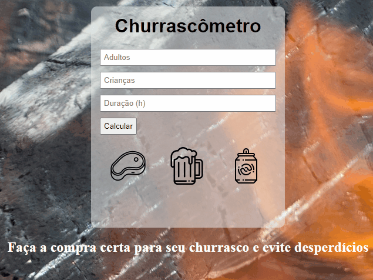

<h1     text-align: center;
> churrascometro </h1>

    <a href="#descrição">Descrição</a>
    <a href="#features">Features</a>
    <a href="#tecnologias">Tecnologias</a>
    <a href="#objetivo">Objetivo</a>

# Descrição

 calculadora para churrasco.
Calcula a quantidade de carne,cerveja e bebidas para criança(refrigerante e água) de acordo com a quantidade de adultos, crianças e a quantidade de horas que o churrasco vai ter

# Features

# Tecnologias

> -   [HTML]()
> -   [CSS]()
> -   [JS]()

# Objetivo

-   Criaçao para desafio de curso de desenvolvimento web full stack, modulo de JS intermediário;
-   Projeto não teve como intenção design com css, pois objetivo era JS;
-   Aceito qualquer crítica construtiva.

By Bruno Vieira [see my linkedIn](https://www.linkedin.com/in/bruno-vieira-861633211/)
